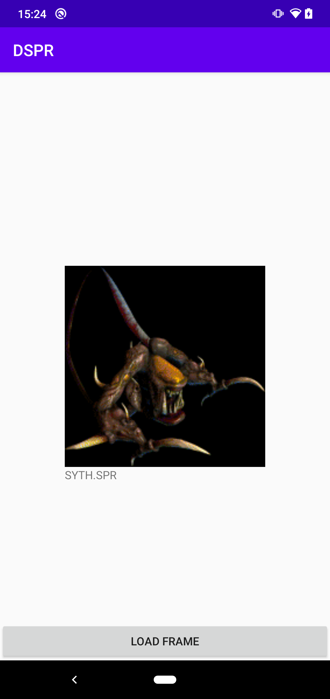

### Implementation of DSPR in Kotlin (Android)
An module responsible for rendering SPR, BTS, MAP and FIN files from Dark Colony.

### Status
Added ability to convert SPR file to Bitmap 

## Screenshot

## Credits

This is a Kotlin version of: 
DSPR (Dmytro's Sprite Viewer) by Dmytro (dima@malikov.us)
http://malikov.us/dspr/

orignal credits:	
dreamerman - author of original SPR2BMP tool and guide to decode DC files
http://www.dreamerman.cba.pl/
